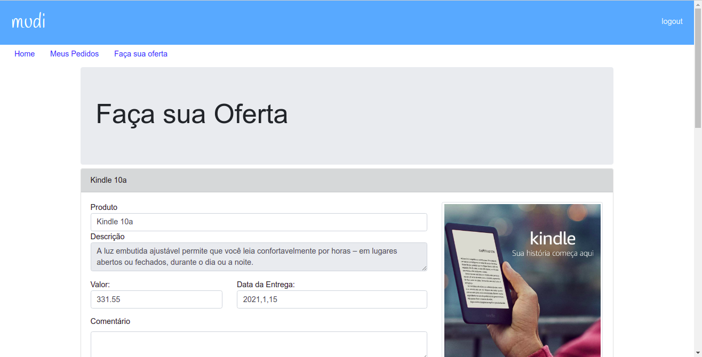
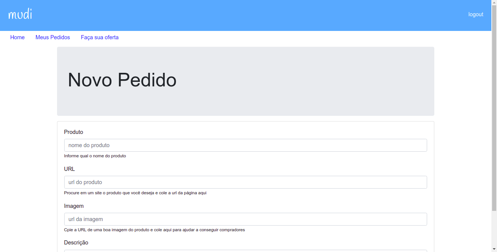

# ➤ Spring MVC: Crie um web app com Thymeleaf e Bootstrap e Autenticação com Spring Security, API Rest e AJAX

Certificados: <a href="https://cursos.alura.com.br/certificate/1c5e20fb-be83-4071-afdb-efc1b40a0dc9" rel="noopener" targer="_blank">I</a> e <a href="https://cursos.alura.com.br/certificate/61fdd247-d895-4042-9006-d72c28aba92e" rel="noopener" targer="_blank">II</a>

## ➤ Mudi

Sistema de cadastro de produtos para geração de pedidos de ofertas sobre os mesmos. Usuários podem gerar ofertas para os pedidos que forem feitos e outros usuários poderão cadastrar pedidos.<br/>

Usuários que estão cadastrados podem ver os pedidos que foram feitos, que estão aguardando ofertas, e podem fazer uma proposta. 

### ➤ Status do Projeto


### ➤ Tecnologias

<p align="left">
	&nbsp
	
</p>

### ➤ Competências:

- Padrão MVC com o Spring MVC
- Thymeleaf e Bootstrap
- Integração com Spring Data
- Trabalhando com Formulários
- Trabalhando com Bean Validation 
- Trabalhando com Templates
- Autenticação com Spring Security
- Provedor de Autenticação
- Paginação e Cache
- Construindo uma API REST
- AJAX e Vue.js
- Validações com Vue.js
- Monitoramento com Interceptadores

### ➤ Imagens do Sistema

#### Login


#### Ofertas



#### Pedidos


#### Pedidos



### ➤ Como rodar a aplicação

1. No terminal, clone o projeto:
    
```
git clone https://github.com/leonardo-teles/mudi
```
2. Importe para dentro do seu Eclipse/STS e/ou IDE favorita
3. Crie uma base de dados no MySQL e configure os parâmetros de conexão no arquivo `application.properties`
	

